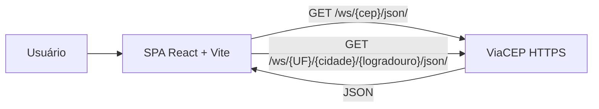
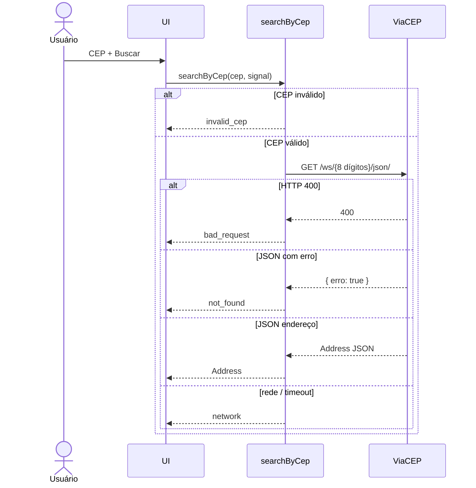

# Arquitetura — Consulta de Endereços ViaCEP

**Produto:** SPA React que consulta a [ViaCEP](https://viacep.com.br/)  
**Complementa:** [`PRD.md`](PRD.md) (comportamento e regras de negócio)  
**Data:** 2026-08-21

Este documento descreve a estrutura da aplicação React. Não cobre o servidor MCP Nix deste repositório.

---

## 1. Visão

Arquitetura em três camadas no cliente:

```
UI (React) → application (hooks / use-cases) → infrastructure (ViaCEP HTTP)
```

Não há backend na v1. O navegador chama `https://viacep.com.br` diretamente. A ViaCEP é o único sistema externo.



## 2. Stack

| Papel | Escolha | Motivo |
| ----- | ------- | ------ |
| UI | React 19 | Pedido do produto; SPA simples. |
| Bundler | Vite | Dev server rápido, TypeScript nativo. |
| Linguagem | TypeScript (`strict`) | Contrato da API modelado em tipos. |
| HTTP | `fetch` nativo | Sem axios; API pública e GET simples. |
| Estilo | CSS modules ou um único `app.css` | Evitar kit pesado no MVP. |
| Testes | Fora da v1 | Só quando o usuário pedir. |

**Não usar na v1:** Next.js, Redux, React Query, jQuery, JSONP, XML.

## 3. Estrutura de pastas

Aplicação a ser criada em `web/` (isolada do pacote Python `nix/`).

```
web/
  index.html
  package.json
  vite.config.ts
  tsconfig.json
  src/
    main.tsx
    app.tsx
    styles/
    domain/
      address.ts          # tipos Address, SearchMode
      cep.ts              # normalizeCep, isValidCep
      uf.ts               # lista das 27 UFs
    application/
      search-by-cep.ts
      search-by-address.ts
    infrastructure/
      viacep-client.ts    # fetch + mapeamento + erros
      viacep-errors.ts
    ui/
      pages/
        home-page.tsx
      components/
        cep-form.tsx
        address-form.tsx
        address-card.tsx
        result-list.tsx
        status-message.tsx
    lib/
      abort.ts            # ignora resposta de request anterior
```

Nomes de arquivos, funções e tipos em **inglês**. Textos da UI em **português**.

## 4. Camadas

### 4.1 Domain

Regras puras, sem I/O:

- `normalizeCep(input)` → remove não dígitos; usado na máscara e na URL.
- `isValidCep(digits)` → `^\d{8}$`.
- `isValidPlaceName(value)` → `trim().length >= 3` (cidade e logradouro).
- `Address` — modelo interno (não vazar o JSON cru da ViaCEP para a UI).

### 4.2 Application

Dois casos de uso:

- `searchByCep(cep, signal)` — valida, chama o client, devolve `Address` ou erro de domínio.
- `searchByAddress({ uf, city, street }, signal)` — valida, chama o client, devolve `Address[]`.

Erros de domínio (a UI só traduz para mensagem):

| Código | Origem |
| ------ | ------ |
| `invalid_cep` | Cliente, antes do HTTP |
| `invalid_address_query` | Cliente (UF/cidade/logradouro) |
| `not_found` | JSON `{ erro: true }` |
| `bad_request` | HTTP 400 |
| `network` | Timeout, offline, 5xx, abort não intencional |

### 4.3 Infrastructure (`viacep-client`)

- Base URL: `https://viacep.com.br`.
- Somente `Accept: application/json`.
- `AbortSignal` + timeout de 8 s (`AbortSignal.timeout` ou `AbortController` equivalente).
- `encodeURIComponent` em cidade e logradouro; UF em maiúsculas.
- CEP na URL **sem hífen**.

### 4.4 UI

- Uma página, duas abas: **Por CEP** e **Por endereço**.
- Estado local (`useState` / `useReducer`). Sem store global.
- Nova busca aborta a anterior (`AbortController`) para não aplicar resultado velho.

## 5. Contrato ViaCEP

Especificação completa na nota `Projetos/ViaCEP/Especificação api.md`. Resumo operacional:

### 5.1 Por CEP

```
GET https://viacep.com.br/ws/{cep}/json/
```

- `{cep}`: 8 dígitos. Inválido → HTTP 400.
- Sucesso: objeto endereço.
- CEP válido e inexistente: `{ "erro": "true" }` (tratar também boolean `true`).

### 5.2 Por endereço

```
GET https://viacep.com.br/ws/{UF}/{cidade}/{logradouro}/json/
```

- UF, cidade e logradouro obrigatórios.
- Cidade ou logradouro com < 3 caracteres → HTTP 400.
- Corpo: array JSON, até 50 itens, ordenado pela API.
- Array vazio → UI de “nenhum resultado” (`not_found`).

### 5.3 Tipo interno

```ts
type Address = {
  zipCode: string;       // como veio da API, ex. "01001-000"
  street: string;
  complement: string;
  unit: string;
  district: string;
  city: string;
  stateCode: string;     // UF
  stateName: string;
  region: string;
  ibge: string;
  gia: string;
  areaCode: string;      // DDD
  siafi: string;
};
```

Mapeamento a partir do JSON da ViaCEP (`cep` → `zipCode`, `logradouro` → `street`, etc.) fica só no client.

## 6. Fluxos

### 6.1 Busca por CEP



### 6.2 Concorrência

Se o usuário dispara outra busca antes da anterior terminar, a anterior é abortada. Resposta abortada **não** vira erro de rede na UI.

## 7. Estado da UI

```ts
type ViewState =
  | { status: "idle" }
  | { status: "loading" }
  | { status: "success"; address: Address }
  | { status: "success_list"; addresses: Address[] }
  | { status: "empty"; message: string }
  | { status: "error"; message: string };
```

Mensagens (exemplos):

- formato CEP: “Informe um CEP com 8 números.”
- não encontrado: “CEP não encontrado na base da ViaCEP.”
- query curta: “Cidade e logradouro precisam de pelo menos 3 caracteres.”
- rede: “Não foi possível consultar a ViaCEP. Verifique a conexão e tente de novo.”

## 8. Configuração

| Variável | Padrão | Uso |
| -------- | ------ | --- |
| `VITE_VIACEP_BASE_URL` | `https://viacep.com.br` | Sobrescrever em testes ou proxy local |

Não há segredos. Não commitar `.env` com dados pessoais.

Proxy Vite (só se CORS falhar — **não implementar na v1**):

```ts
// vite.config.ts — fallback documentado, não ativo
server: {
  proxy: {
    "/viacep": {
      target: "https://viacep.com.br",
      changeOrigin: true,
      rewrite: (path) => path.replace(/^\/viacep/, ""),
    },
  },
}
```

## 9. Segurança

| Tema | Decisão |
| ---- | ------- |
| Auth | Nenhuma. API pública. |
| Segredos | Nenhum. |
| PII | CEP e endereço não saem do navegador (exceto a própria ViaCEP). Sem analytics na v1. |
| XSS | Renderizar campos da API como texto (React escapa por padrão). Não usar `dangerouslySetInnerHTML`. |
| Abuso | Submit explícito; sem loop de CEPs; timeout curto. |
| Dependências | Lockfile commitado; sem pacotes só para máscara se o domain resolver. |
| Mixed content | Sempre HTTPS para a ViaCEP. |

A ViaCEP alerta: uso massivo para validar bases locais pode bloquear o IP. O client não expõe endpoint de “validar lista”.

## 10. Observabilidade

- v1: erros de rede apenas no estado da UI.
- Dev: `console.error` com código de erro de domínio, **sem** dump completo se não ajudar no debug.
- Sem OpenTelemetry, Sentry ou logs remotos na v1.

## 11. Qualidade

Validação padrão de alteração (alinhada ao `AGENTS.md`): comportamento conferido na mão + types limpos (`tsc --noEmit`). Sem suíte de testes até pedido explícito.

Checklist manual: critérios de aceite do [`PRD.md`](PRD.md) §11.

## 12. Decisões

| Decisão | Escolha | Alternativa rejeitada |
| ------- | ------- | --------------------- |
| Hosting da API | Cliente → ViaCEP direto | BFF (complexidade sem ganho na v1) |
| Formato | JSON | XML / JSONP (legado) |
| Estado | Hooks locais | Redux / Zustand |
| Busca automática | Só no submit | Debounce a cada tecla (risco de abuso) |
| Pasta do app | `web/` | Misturar com `nix/` |
| Histórico | `localStorage` opcional (Could) | Servidor |

## 13. Premissas técnicas

1. CORS da ViaCEP permite `fetch` do origin local (`localhost`) e do origin de produção estático.
2. Se essa premissa falhar, ativa-se o proxy da §8 **antes** de criar backend.
3. O campo `erro` pode chegar como string ou boolean — o mapper normaliza.
4. Lista da busca por endereço pode vir como array vazio; tratar como `empty`, não como parse error.
